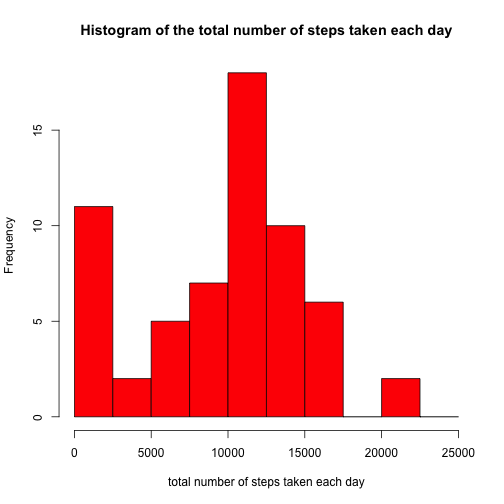
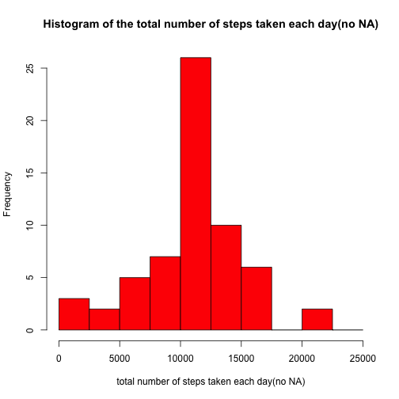
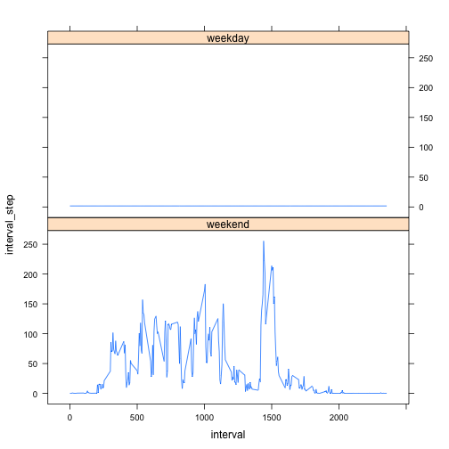

# Reproducible Research: Peer Assessment 1
This is my first R Markdown file

## Loading and preprocessing the data

```r
#1. Load the data
    library(data.table)
    oridata <- fread("activity.csv")
#2. Transform the date
    # n1 is number of intervals per day
    n1 <- sum(oridata$date=="2012-10-01") 
    oridata$date <- as.Date(oridata$date,format="%Y-%m-%d")

head(oridata)
```

```
##    steps       date interval
## 1:    NA 2012-10-01        0
## 2:    NA 2012-10-01        5
## 3:    NA 2012-10-01       10
## 4:    NA 2012-10-01       15
## 5:    NA 2012-10-01       20
## 6:    NA 2012-10-01       25
```

## What is mean total number of steps taken per day?

```r
#1. Calculate the total number of steps taken each day
    subdata <- split(oridata,oridata$date)
    # l is number of days in the dataset
    l <- length(subdata)

## total_day is the vector store the total number of step each day
    total_day <- c(1:l)
for(i in 1:l){
    end <- n1*i
    start <- end-n1+1    
    day <- c(start:end)
    step <- oridata$steps[day]
    total_day[i] <- sum(step,na.rm=TRUE)
}
    range(total_day)
```

```
## [1]     0 21194
```

```r
#2. Make a histogram of the total number of step each day
hist(total_day,breaks=seq(0,25000,2500),
     freq=TRUE,col="red",
     main="Histogram of the total number of steps taken each day",
     xlab = "total number of steps taken each day"
     )
```

 

```r
#3. Report the mean and median of total steps taken per day
mean1 <- mean(total_day)
median1 <- median(total_day)
mean1
```

```
## [1] 9354
```

```r
median1
```

```
## [1] 10395
```


## What is the average daily activity pattern?

```r
# 1. Make a time series plot
## interval_steps is the vector store the total number of steps in each interval
interval_steps <- c(1:n1)
extract <- seq(n1,nrow(oridata),n1)
extract <- extract+1
for (i in 1:n1){
    extract <- extract-1
    newdata <- oridata$steps[extract]
    interval_steps[i] <- mean(newdata,na.rm=TRUE) 
}
interval_steps <- rev(interval_steps)

plot(oridata$interval[1:n1],interval_steps,
     type="l",
     xlab="interval",
     ylab="average steps")
```

 

```r
#2. Which 5-minute interval, on average across all the days in the dataset, contains the maximum number of steps?
oridata$interval[which(interval_steps==max(interval_steps))]
```

```
## [1] 835
```


## Imputing missing values

```r
#1. Calculate and report the total number of missing values in the dataset (i.e. the total number of rows with `NA`s)
sum(is.na(oridata))
```

```
## [1] 2304
```

```r
#2. Devise a strategy for filling in all of the missing values in the dataset. The strategy does not need to be sophisticated. For example, you could use the mean/median for that day, or the mean for that 5-minute interval, etc.
#use the mean for that 5-minute interval to fill the missing values
#3. Create a new dataset that is equal to the original dataset but with the missing data filled in.
extract <- seq(n1,nrow(oridata),n1)
extract <- extract-287

no_Na_Data <- oridata
for (i in 1:n1){    
    nas <- is.na(no_Na_Data$steps[extract])
    n2 <- length(no_Na_Data$steps[extract][nas])
    for(j in 1:n2){
         no_Na_Data$steps[extract][nas][j] <- interval_steps[i]
     }
     extract <- extract+1
 }

sum(is.na(no_Na_Data))
```

```
## [1] 0
```

```r
#4. Make a histogram of the total number of steps taken each day and Calculate and report the **mean** and **median** total number of steps taken per day. Do these values differ from the estimates from the first part of the assignment? What is the impact of imputing missing data on the estimates of the total daily number of steps?
total_day2 <- c(1:l)
for(i in 1:l){
    end <- n1*i
    start <- end-n1+1    
    day <- c(start:end)
    step2 <- no_Na_Data$steps[day]
    total_day2[i] <- sum(step2,na.rm=TRUE)
}

hist(total_day2,breaks=seq(0,25000,2500),
     freq=TRUE,col="red",
     main="Histogram of the total number of steps taken each day(no NA)",
     xlab = "total number of steps taken each day(no NA)"
)
```

 

```r
# Report the mean and median of total steps taken per day
mean2 <- mean(total_day2)
median2 <- median(total_day2)
mean2
```

```
## [1] 10766
```

```r
median2
```

```
## [1] 10766
```

```r
# Make comparison
mean1 - mean2
```

```
## [1] -1412
```

```r
median1 - median2
```

```
## [1] -371.2
```

## Are there differences in activity patterns between weekdays and weekends?

```r
no_Na_Data$date <- weekdays(no_Na_Data$date,abbreviate=FALSE)
data <- no_Na_Data

# weekends
Sat <- data[which(data$date=="星期六"),]
Sun <- data[which(data$date=="星期日"),]
weekend <- rbind(Sat,Sun)
n_1 <- nrow(Sat) #nrow(Sat)/n1 is the number of Saturdays in the dataset
extract1 <- seq(n1,n_1,n1)
extract1 <- extract1+1
interval_weekend <- c(1:n1)
for(i in 1:n1){
    extract1 <- extract1-1
    newdata <- weekend$steps[extract1]
    weekend$date[extract1] <- "weekend"
    interval_weekend[i]<-mean(newdata)
}
inteval_weekend <- rev(interval_weekend)
interval <- data$interval[c(1:n1)]
type <- weekend$date[c(1:n1)]
interval_step <- interval_weekend
weekenddf <- data.frame(interval,interval_step,type)

#weekdays
Mon <- data[which(data$date=="星期一"),]
Tue <- data[which(data$date=="星期二"),]
Wed <- data[which(data$date=="星期三"),]
Thu <- data[which(data$date=="星期四"),]
Fri <- data[which(data$date=="星期五"),]
weekday <- rbind(Mon,Tue,Wed,Thu,Fri)
n_2 <- nrow(Mon) #nrow(Mon)/n1 is the number Mondays in the dataset
extract2 <- seq(n1,n_2,n2)
extract2 <- extract2+1
interval_weekday <- c(1:n1)
for(i in 1:n1){
    extract2 <- extract2-1
    newdata <- weekday$steps[extract1]
    weekday$date[extract2]<-"weekday"
    interval_weekday[i]<-mean(newdata)
}
inteval_weekday <- rev(interval_weekday)
interval <- data$interval[c(1:n1)]
type <- weekday$date[c(1:n1)]
interval_step <- interval_weekday
weekdaydf <- data.frame(interval,interval_step,type)

# build a new data frame to melt the interval and steps
# interval 1:288
# mean_steps:interval_weekend & interval_weekday 1:288
# type:weekdays or weekends
interval_df <- rbind(weekenddf,weekdaydf)
library(lattice)
xyplot(interval_step~interval | type,
       interval_df,type="l",
       layout=c(1,2))
```

 
